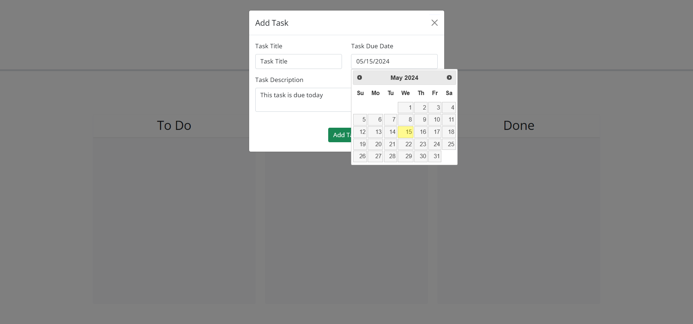
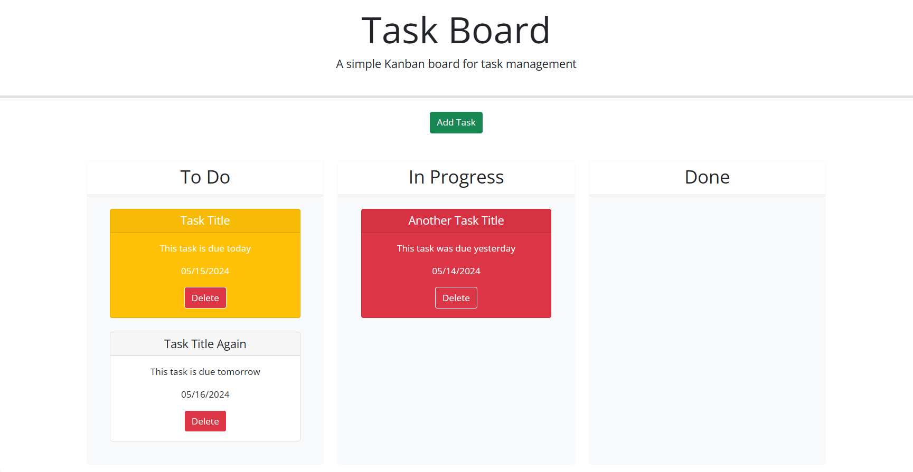

# Task Board

## Description

A Kanban style task board that allows users to add project tasks and manage their progress.

The deployed web application can be found here: https://hannahschwen.github.io/task-board/

## Usage

To add a new task, users should click the green "Add Task" button and fill out the modal form with the details of their task.

The following screenshot displays the modal form:

After adding the task, a task card will appear in the column marked "To Do." Click, drag, and drop any task card to a different column to track its progress. Task cards will appear yellow on the day they are due and red if they are past due. If placed in the "Done" column, the task will revert to white.

The following screenshot displays a few tasks sorted into columns:

To delete a task, click the "Delete" button on the task card. This action can't be undone.

This task board uses the browser's local storage to save tasks. The task cards and their progress will retain if the page is closed or refreshed. Clearing your cookies for this site will delete all tasks.

## Credits

Starter code for this project was supplied by edX Boot Camps LLC. The starter code can be found in the "starter-code" file in the repository.